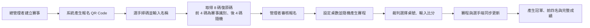
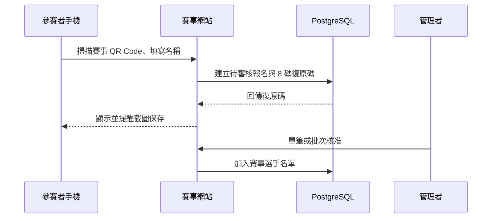
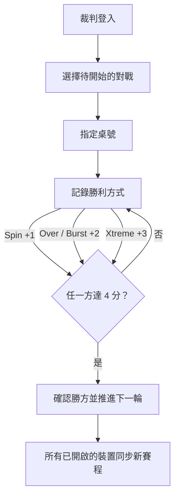
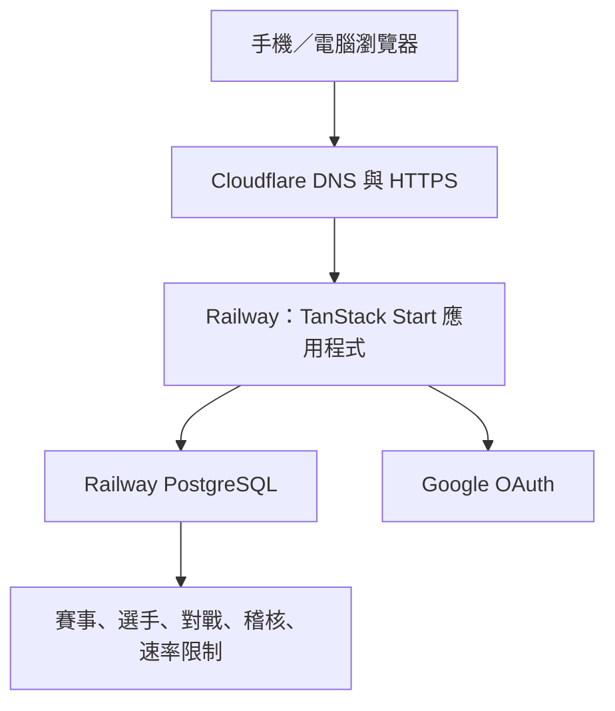

<p align="center">
  
</p>

<h1 align="center">Beyblade Tournament System</h1>

<p align="center">行動優先的 Beyblade X 賽事管理系統：QR Code 報名、多桌裁判計分、即時賽程與公開成績。</p>

<p align="center">
  <a href="https://beyblade-tournament.com/">正式網站</a> ·
  <a href="https://beyblade-tournament.com/health/database">資料庫健康檢查</a>
</p>

## 這個系統能做什麼？

| 對象 | 可以完成的事 |
| --- | --- |
| 參賽者 | 掃描 QR Code 報名、取得 8 碼復原碼、在換手機或重新整理後恢復自己的參賽身分、觀看即時賽程與成績。 |
| 裁判／管理者 | 以帳號密碼登入、審核 QR 報名、選擇桌號、記錄每局勝利方式與比分。 |
| 總管理者 | 以 Google 登入擁有系統、建立其他管理者、建立賽事與 QR Code、設定桌數、產生賽程、重置賽事與匯出稽核紀錄。 |

## 賽事流程



## 功能一覽

### QR 報名與復原碼



- 每位選手的復原碼為 8 碼純數字；同一賽事共用前 4 碼，後 4 碼隨機。
- 參賽者可透過「名稱 + 復原碼」在新裝置或重新整理後重新認領身分。
- 管理者可在選手頁查看已核准選手的復原碼，協助現場支援。
- 公開報名 API 受 PostgreSQL 共用速率限制保護：同一賽事、同一 IP 在 15 分鐘最多 256 次報名請求。

### 多桌計分與賽程



- 支援 1–12 桌；每場開始時由裁判選擇桌號。
- 計分採 Beyblade X 勝利方式：Spin +1、Over +2、Burst +2、Xtreme +3；先達 4 分獲勝。
- 支援季軍賽，完賽後自動產生冠軍、亞軍、季軍與第四名。
- 賽程可縮放、拖曳與檢視已完成場次的歷史比分。
- 選手端每 3 秒、管理端每 2.5 秒輪詢 Railway 資料，讓多位裁判可協作計分。

### 權限與稽核

| 角色 | 登入方式 | 權限摘要 |
| --- | --- | --- |
| 擁有者 | Google OAuth | 建立／移除管理者、設定總管理者、完整稽核與賽事控制。 |
| 總管理者 | 帳號密碼或 Google OAuth | 建立賽事、QR 報名管理、產生賽程、設定桌數、重置賽事、計分。 |
| 管理者／裁判 | 帳號密碼 | 審核選手、進行多桌計分、查看賽程。 |
| 參賽者／觀眾 | 賽事 QR Code | 僅能報名、復原身分、觀看賽程與成績。 |

所有管理操作都會寫入稽核紀錄，包含建立賽事、核准報名、產生賽程、開始比賽、計分與重置等事件。

## 線上架構



- 網域：`beyblade-tournament.com`
- 應用程式：Railway
- 資料庫：Railway PostgreSQL
- 身分驗證：Google OAuth（擁有者）與安全雜湊的管理者帳密
- 部署：推送 `main` 後由 Railway 建置，部署前自動執行資料庫 migration。

## 本機開發

需求：Bun 1.3+、Node.js 22+，以及可連線的 PostgreSQL。

```bash
bun install --frozen-lockfile
copy .env.example .env
bun run db:migrate
bun run dev
```

開發伺服器啟動後，開啟終端機顯示的本機網址。

## 環境變數

| 變數 | 用途 |
| --- | --- |
| `APP_URL` | 應用程式完整網址，例如 `https://beyblade-tournament.com`。 |
| `DATABASE_URL` | Railway PostgreSQL 連線字串。 |
| `DATABASE_POOL_MAX` | 資料庫連線池上限，預設為 `5`。 |
| `GOOGLE_CLIENT_ID` | Google OAuth 網頁用戶端 ID。 |
| `GOOGLE_CLIENT_SECRET` | Google OAuth 用戶端密鑰。 |
| `PLATFORM_OWNER_EMAIL` | 經 Google 驗證的平台擁有者信箱；伺服器端權限以此設定為準。 |
| `VITE_PLATFORM_OWNER_EMAIL` | 與 `PLATFORM_OWNER_EMAIL` 相同，供舊版瀏覽器端管理介面辨識擁有者。 |
| `ADMIN_PASSWORD_ENCRYPTION_KEY` | 管理者密碼資料的伺服器端加密金鑰；必須保密。 |
| `MAX_TOURNAMENT_REGISTRATIONS` | 每場可接受的報名上限，預設為 `128`。 |
| `VITE_RAILWAY_AUTH_ENABLED` | 啟用 Railway 的伺服器端登入與 API 路徑時設為 `true`。 |

> 不要把 `.env`、資料庫 URL、OAuth 密鑰或加密金鑰提交到 Git。

## 檢查與測試

```bash
bun run lint
bun run typecheck
bun run test
bun run build
```

部署完成後建議依序確認：

1. 開啟 [`/health/database`](https://beyblade-tournament.com/health/database)，確認回應包含 `"ok": true` 與 `"database": "postgres"`。
2. 使用 Google 擁有者登入，再以管理者帳密登入一次。
3. 建立測試賽事，使用兩支手機測試 QR 報名、復原碼與選手端賽程同步。
4. 產生賽程後，以兩個裁判帳號在不同桌測試計分與歷史比分。

## 備份與營運建議

1. 在正式賽事前，於 Railway PostgreSQL 建立備份或 snapshot。
2. 賽事期間避免重置賽事；重置需要兩次確認，且會清除目前選手、賽程與比分。
3. 賽後保留完賽賽事與稽核紀錄，並定期檢查 Railway 的 CPU、記憶體、網路與資料庫連線數。
4. 若有重大操作需求，先在測試賽事驗證，再套用到正式賽事。

## 專案結構

```text
src/components/        介面：報名、賽程、計分、設定與稽核
src/lib/               賽程邏輯、同步、授權、速率限制與 API 客戶端
src/routes/            網頁路由與 Railway API
database/migrations/   PostgreSQL schema 與營運強化 migration
scripts/               資料庫 migration、檢查與資料匯入工具
```
